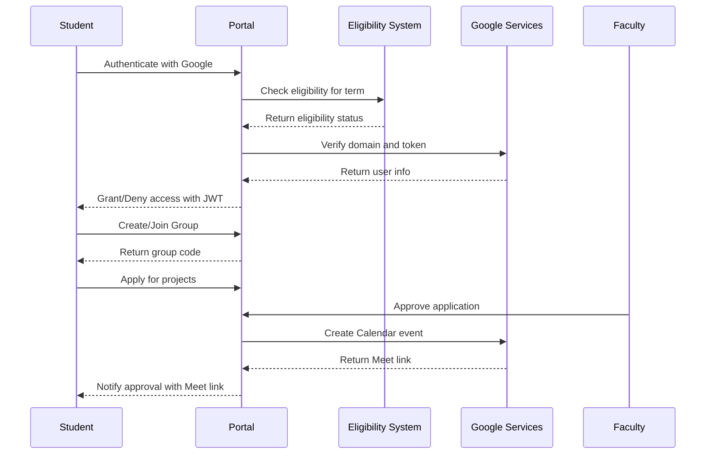

# Design Document

## Overview

The SRM University-AP Project Management Portal is designed as a lean MVP with a focus on essential functionality. The system follows a traditional MERN stack architecture with strict authentication controls, simplified user workflows, and integrated Google services for meeting management. The design emphasizes performance, accessibility, and maintainability while removing complex features like 3D visualizations and heavy analytics.

## Architecture

### System Architecture

```mermaid
graph TB
    subgraph "Frontend (Vercel)"
        A[React + TypeScript]
        B[Tailwind CSS + Theme Tokens]
        C[Framer Motion (Minimal)]
        D[Lucide Icons]
    end
    
    subgraph "Backend (Render)"
        E[Express + TypeScript]
        F[Mongoose ODM]
        G[JWT + RBAC]
        H[Zod/Joi Validation]
        I[Swagger Documentation]
    end
    
    subgraph "External Services"
        J[MongoDB Atlas]
        K[Google OAuth 2.0]
        L[Google Calendar API]
        M[File Storage System]
    end
    
    A --> E
    E --> J
    E --> K
    E --> L
    E --> M
    
    subgraph "Authentication Flow"
        N[Google OAuth] --> O[Domain Validation]
        O --> P[Eligibility Check]
        P --> Q[JWT Generation]
    end
```

### Data Flow Architecture



## Components and Interfaces

### Core Data Models

#### Project Model
```typescript
interface Project {
  _id: ObjectId;
  title: string;
  brief: string;
  description?: string;
  type: 'IDP' | 'UROP' | 'CAPSTONE';
  department: string;
  prerequisites?: string;
  facultyId: ObjectId;
  facultyName: string; // Denormalized for performance
  capacity?: number;
  status: 'draft' | 'published' | 'archived';
  createdAt: Date;
  updatedAt: Date;
}
```

#### Eligibility Model
```typescript
interface Eligibility {
  _id: ObjectId;
  studentEmail: string;
  regNo?: string;
  year: 2 | 3 | 4;
  semester: 3 | 4 | 7 | 8;
  termKind: 'odd' | 'even'; // odd: Jan-May, even: Aug-Dec
  type: 'IDP' | 'UROP' | 'CAPSTONE';
  validFrom: Date;
  validTo: Date;
  createdAt: Date;
  updatedAt: Date;
}
```

#### Group Model
```typescript
interface Group {
  _id: ObjectId;
  code: string; // 6-char A-Z + 2-9 (no O/0 I/1 S/5)
  type: 'IDP' | 'UROP' | 'CAPSTONE';
  memberIds: ObjectId[]; // 1-4 students
  projectId?: ObjectId;
  facultyId?: ObjectId;
  meetUrl?: string;
  calendarEventId?: string;
  status: 'forming' | 'applied' | 'approved' | 'rejected' | 'frozen';
  createdAt: Date;
  updatedAt: Date;
}
```

#### Evaluation Model
```typescript
interface Evaluation {
  _id: ObjectId;
  groupId: ObjectId;
  projectId: ObjectId;
  facultyId: ObjectId;
  externalFacultyId?: ObjectId;
  internal: {
    a1: { conduct: number; convert: number }; // 0-20 → 0-10
    a2: { conduct: number; convert: number }; // 0-30 → 0-15
    a3: { conduct: number; convert: number }; // 0-50 → 0-25
  };
  external: {
    reportPresentation: { conduct: number; convert: number }; // 0-100 → 0-50
  };
  totalInternal: number;
  totalExternal: number;
  total: number;
  isPublished: boolean;
  publishedAt?: Date;
  publishedBy?: ObjectId;
  createdAt: Date;
  updatedAt: Date;
}
```

### Authentication System Design

#### Role-Based Access Control
```typescript
enum UserRole {
  STUDENT = 'student',
  FACULTY = 'faculty',
  COORDINATOR = 'coordinator',
  ADMIN = 'admin'
}

interface AuthContext {
  user: {
    email: string;
    name: string;
    role: UserRole;
    eligibility?: Eligibility;
    facultyInfo?: FacultyRoster;
  };
  permissions: string[];
}
```

#### Authentication Flow
1. **Google OAuth Integration**: Verify ID token and extract user information
2. **Domain Validation**: Ensure email belongs to @srmap.edu.in domain
3. **Eligibility Check**: For students, verify presence in Eligibility collection
4. **Faculty Validation**: For faculty, verify presence in FacultyRoster with active status
5. **JWT Generation**: Create signed JWT with user context and permissions
6. **Session Management**: Implement refresh token rotation for security

### Group Code Generation System

#### Code Generation Algorithm
```typescript
class GroupCodeGenerator {
  private static readonly CHARS = 'ABCDEFGHJKLMNPQRTUVWXYZ23456789';
  // Excludes: O/0, I/1, S/5 for clarity
  
  static generate(): string {
    let code = '';
    for (let i = 0; i < 6; i++) {
      code += this.CHARS[Math.floor(Math.random() * this.CHARS.length)];
    }
    return code;
  }
  
  static async generateUnique(): Promise<string> {
    let attempts = 0;
    while (attempts < 10) {
      const code = this.generate();
      const exists = await Group.findOne({ code });
      if (!exists) return code;
      attempts++;
    }
    throw new Error('Unable to generate unique code');
  }
}
```

### Google Calendar Integration

#### Meet Link Generation
```typescript
interface CalendarEventConfig {
  summary: string;
  description: string;
  attendees: { email: string }[];
  conferenceData: {
    createRequest: {
      requestId: string;
      conferenceSolutionKey: { type: 'hangoutsMeet' };
    };
  };
}

class MeetIntegration {
  async createGroupMeeting(group: Group, project: Project): Promise<{
    meetUrl: string;
    calendarEventId: string;
  }> {
    const event = await this.calendarService.events.insert({
      calendarId: 'primary',
      conferenceDataVersion: 1,
      requestBody: {
        summary: `${project.title} - Group ${group.code}`,
        attendees: await this.getGroupAttendees(group),
        conferenceData: {
          createRequest: {
            requestId: `group-${group._id}-${Date.now()}`,
            conferenceSolutionKey: { type: 'hangoutsMeet' }
          }
        }
      }
    });
    
    return {
      meetUrl: event.data.conferenceData?.entryPoints?.[0]?.uri || '',
      calendarEventId: event.data.id || ''
    };
  }
}
```

### Window System Design

#### Time-Based Access Control
```typescript
interface Window {
  _id: ObjectId;
  kind: 'grouping' | 'application' | 'faculty-edit-title' | 'internal-eval' | 'external-eval';
  type: 'IDP' | 'UROP' | 'CAPSTONE';
  start: Date;
  end: Date;
  enforced: boolean;
}

class WindowService {
  async isWindowActive(kind: string, type: string): Promise<boolean> {
    const window = await Window.findOne({ kind, type, enforced: true });
    if (!window) return true; // No enforcement
    
    const now = new Date();
    return now >= window.start && now <= window.end;
  }
  
  middleware(kind: string) {
    return async (req: Request, res: Response, next: NextFunction) => {
      const { type } = req.body || req.query;
      const isActive = await this.isWindowActive(kind, type);
      
      if (!isActive) {
        return res.status(403).json({
          error: 'Window not active',
          message: `${kind} window is not currently active for ${type}`
        });
      }
      
      next();
    };
  }
}
```

## Data Models

### Database Indexes

```javascript
// Eligibility indexes
db.eligibilities.createIndex({ 
  studentEmail: 1, 
  type: 1, 
  termKind: 1, 
  year: 1, 
  semester: 1 
});

// FacultyRoster indexes
db.facultyrosters.createIndex({ email: 1 }, { unique: true });

// Project indexes
db.projects.createIndex({ status: 1, type: 1, department: 1 });

// Group indexes
db.groups.createIndex({ code: 1 }, { unique: true });

// Evaluation indexes
db.evaluations.createIndex({ groupId: 1, projectId: 1 });
```

### Evaluation Conversion Logic

```typescript
class EvaluationService {
  static convertScores(evaluation: Partial<Evaluation>): Evaluation {
    const internal = evaluation.internal || {};
    
    // A1: 0-20 → 0-10
    if (internal.a1) {
      internal.a1.convert = Math.min(10, Math.round(internal.a1.conduct * 10 / 20));
    }
    
    // A2: 0-30 → 0-15
    if (internal.a2) {
      internal.a2.convert = Math.min(15, Math.round(internal.a2.conduct * 15 / 30));
    }
    
    // A3: 0-50 → 0-25
    if (internal.a3) {
      internal.a3.convert = Math.min(25, Math.round(internal.a3.conduct * 25 / 50));
    }
    
    // External: 0-100 → 0-50
    const external = evaluation.external || {};
    if (external.reportPresentation) {
      external.reportPresentation.convert = Math.min(50, 
        Math.round(external.reportPresentation.conduct * 50 / 100));
    }
    
    // Calculate totals
    const totalInternal = (internal.a1?.convert || 0) + 
                         (internal.a2?.convert || 0) + 
                         (internal.a3?.convert || 0);
    const totalExternal = external.reportPresentation?.convert || 0;
    
    return {
      ...evaluation,
      internal,
      external,
      totalInternal,
      totalExternal,
      total: totalInternal + totalExternal
    } as Evaluation;
  }
}
```

## Error Handling

### Authentication Error Responses

```typescript
interface AuthErrorResponse {
  error: string;
  message: string;
  guidance?: string;
  statusCode: number;
}

class AuthErrorHandler {
  static handleStudentNotEligible(year: number): AuthErrorResponse {
    const guidance = {
      2: 'IDP projects are available from year 2',
      3: 'UROP projects are available from semester 7',
      4: 'CAPSTONE projects are available from semester 8'
    };
    
    return {
      error: 'Not Eligible',
      message: 'Student not found in eligibility roster for current term',
      guidance: guidance[year] || 'Contact academic office for eligibility',
      statusCode: 403
    };
  }
  
  static handleFacultyNotFound(): AuthErrorResponse {
    return {
      error: 'Access Denied',
      message: 'Faculty member not found in roster or inactive',
      guidance: 'Contact administration to activate faculty account',
      statusCode: 403
    };
  }
}
```

### API Error Handling Middleware

```typescript
class ErrorHandler {
  static globalHandler(err: Error, req: Request, res: Response, next: NextFunction) {
    if (err instanceof ValidationError) {
      return res.status(400).json({
        error: 'Validation Error',
        details: err.details
      });
    }
    
    if (err instanceof AuthenticationError) {
      return res.status(401).json({
        error: 'Authentication Failed',
        message: err.message
      });
    }
    
    if (err instanceof WindowNotActiveError) {
      return res.status(403).json({
        error: 'Window Not Active',
        message: err.message,
        activeWindows: err.activeWindows
      });
    }
    
    // Log unexpected errors
    console.error('Unexpected error:', err);
    
    return res.status(500).json({
      error: 'Internal Server Error',
      message: 'An unexpected error occurred'
    });
  }
}
```

## Testing Strategy

### Unit Testing Approach

1. **Model Validation**: Test Mongoose schema validation and custom validators
2. **Service Logic**: Test business logic in isolation with mocked dependencies
3. **Utility Functions**: Test group code generation, evaluation conversions, date calculations
4. **Authentication**: Test JWT generation, role validation, eligibility checking

### Integration Testing

1. **API Endpoints**: Test complete request/response cycles with test database
2. **Google Integration**: Test Calendar API integration with mock responses
3. **File Upload**: Test file handling and validation with temporary storage
4. **Database Operations**: Test complex queries and transactions

### End-to-End Testing

1. **Student Workflow**: Complete flow from authentication to submission
2. **Faculty Workflow**: Project creation, approval, and evaluation
3. **Coordinator Workflow**: Window management and grade publication
4. **Admin Workflow**: Data import and user management

### Performance Testing

1. **Database Queries**: Ensure indexes are effective for common queries
2. **File Upload**: Test large file handling and concurrent uploads
3. **Concurrent Users**: Test system behavior under load
4. **API Response Times**: Ensure sub-200ms response times for critical endpoints

## Security Considerations

### Data Protection

1. **Input Validation**: Use Zod/Joi for all API inputs
2. **SQL Injection Prevention**: Mongoose ODM provides protection
3. **XSS Prevention**: Sanitize all user inputs and use CSP headers
4. **File Upload Security**: Validate file types, scan for malware, limit sizes

### Authentication Security

1. **JWT Security**: Short-lived access tokens with refresh rotation
2. **Google OAuth**: Verify tokens server-side, validate domain restrictions
3. **Session Management**: Secure cookie settings, HTTPS enforcement
4. **Rate Limiting**: Implement per-IP and per-user rate limits

### Access Control

1. **Role-Based Permissions**: Strict RBAC with principle of least privilege
2. **Resource Ownership**: Ensure users can only access their own data
3. **Window Enforcement**: Time-based access controls for sensitive operations
4. **Audit Logging**: Log all administrative actions and grade publications

This design provides a solid foundation for the lean MVP while maintaining security, performance, and scalability requirements. The simplified architecture removes complex features while preserving essential functionality for project management and evaluation.