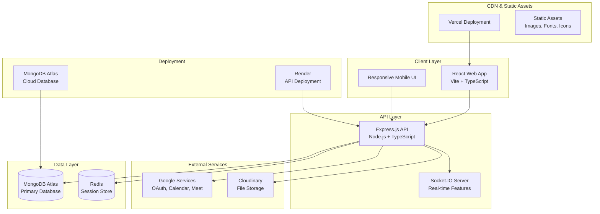
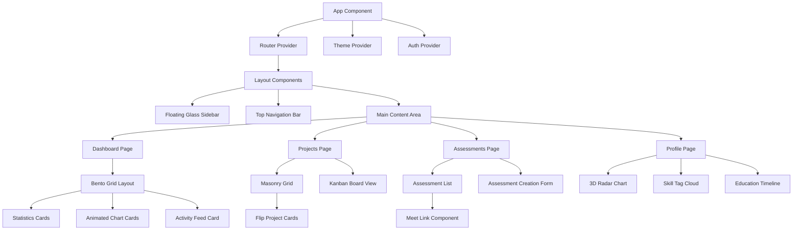
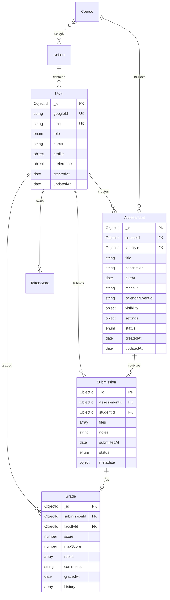

# Design Document

## Overview

The SRM University-AP Project Management Portal is designed as a modern, full-stack web application using the MERN stack with TypeScript. The system follows a microservices-inspired architecture with clear separation between frontend and backend, integrated with Google services for authentication and calendar management. The design emphasizes performance, security, and user experience through advanced UI components and real-time features.

## Architecture

### High-Level Architecture



### System Components

#### Frontend Architecture

- **Framework**: React 18 with Vite for fast development and optimized builds
- **Routing**: React Router v6 with lazy loading and code splitting
- **State Management**: React Query for server state, Zustand for client state
- **Styling**: Tailwind CSS with custom design tokens and glassmorphism components
- **Animations**: Framer Motion for page transitions and micro-interactions
- **3D Graphics**: Three.js for hero animations and interactive elements
- **Charts**: Recharts with custom animations and themes

#### Backend Architecture

- **Framework**: Express.js with TypeScript for type safety
- **Database**: MongoDB with Mongoose ODM for schema validation
- **Authentication**: JWT tokens with Google OAuth 2.0 integration
- **Real-time**: Socket.IO for presence indicators and live updates
- **File Upload**: Cloudinary integration with signed upload URLs
- **API Documentation**: OpenAPI 3.0 with Swagger UI

## Components and Interfaces

### Frontend Component Architecture



### Key UI Components

#### Core Components

- **GlassCard**: Glassmorphism container with backdrop blur and gradient borders
- **GlowButton**: Interactive button with neon hover effects and magnetic animation
- **GradientBorderBox**: Container with animated gradient borders
- **CommandPalette**: Keyboard-accessible quick action interface (Cmd/Ctrl+K)
- **PresenceAvatar**: Real-time user presence indicators with WebSocket integration

#### Layout Components

- **FloatingGlassSidebar**: Navigation sidebar with glassmorphism design
- **TopNavigationBar**: Header with breadcrumbs, search, and user menu
- **BentoGrid**: Responsive grid layout for dashboard cards
- **MasonryGrid**: Pinterest-style layout for project cards

#### Interactive Components

- **FlipCard**: 3D card flip animations for project previews
- **AnimatedChart**: Recharts integration with Framer Motion animations
- **3DCarousel**: Three.js powered carousel for project artifacts
- **ParallaxHero**: Parallax scrolling hero sections with 3D elements

### API Interface Design

#### Authentication Endpoints

```typescript
// Auth Routes
POST /auth/google
  Body: { code: string, state?: string }
  Response: { token: string, user: UserProfile, expiresIn: number }

GET /auth/me
  Headers: { Authorization: "Bearer <token>" }
  Response: { user: UserProfile, permissions: string[] }

POST /auth/refresh
  Body: { refreshToken: string }
  Response: { token: string, expiresIn: number }
```

#### Assessment Management

```typescript
// Assessment Routes
POST /assessments
  Body: CreateAssessmentRequest
  Response: { assessment: Assessment, meetUrl: string, calendarEventId: string }

GET /assessments
  Query: { scope?: 'mine'|'course'|'cohort', courseId?: string, cohortId?: string }
  Response: { assessments: Assessment[], pagination: PaginationInfo }

PATCH /assessments/:id
  Body: UpdateAssessmentRequest
  Response: { assessment: Assessment, updated: boolean }

DELETE /assessments/:id
  Response: { deleted: boolean, calendarEventDeleted: boolean }
```

#### Submission and Grading

```typescript
// Submission Routes
POST /assessments/:id/submissions
  Body: FormData with files and metadata
  Response: { submission: Submission, uploadUrls: SignedUrl[] }

GET /submissions/:id
  Response: { submission: Submission, files: FileMetadata[], grade?: Grade }

POST /submissions/:id/grade
  Body: { score: number, rubric?: object, comments: string }
  Response: { grade: Grade, submission: Submission }
```

## Data Models

### Core Data Schemas

```typescript
// User Schema
interface User {
  _id: ObjectId;
  googleId: string;
  name: string;
  email: string; // Must end with @srmap.edu.in
  role: 'student' | 'faculty' | 'admin';
  avatarUrl?: string;
  profile: {
    department?: string;
    year?: number;
    skills?: string[];
    bio?: string;
  };
  preferences: {
    theme: 'light' | 'dark';
    notifications: boolean;
  };
  createdAt: Date;
  updatedAt: Date;
}

// Assessment Schema
interface Assessment {
  _id: ObjectId;
  courseId: ObjectId;
  facultyId: ObjectId;
  title: string;
  description: string;
  dueAt: Date;
  meetUrl?: string;
  calendarEventId?: string;
  visibility: {
    cohortIds: ObjectId[];
    courseIds: ObjectId[];
  };
  settings: {
    allowLateSubmissions: boolean;
    maxFileSize: number;
    allowedFileTypes: string[];
  };
  status: 'draft' | 'published' | 'closed';
  createdAt: Date;
  updatedAt: Date;
}

// Submission Schema
interface Submission {
  _id: ObjectId;
  assessmentId: ObjectId;
  studentId: ObjectId;
  files: FileMetadata[];
  notes?: string;
  submittedAt: Date;
  status: 'submitted' | 'graded' | 'returned';
  metadata: {
    ipAddress: string;
    userAgent: string;
    fileCount: number;
    totalSize: number;
  };
}

// Grade Schema
interface Grade {
  _id: ObjectId;
  submissionId: ObjectId;
  facultyId: ObjectId;
  score: number;
  maxScore: number;
  rubric?: {
    criteria: string;
    points: number;
    feedback: string;
  }[];
  comments: string;
  gradedAt: Date;
  history: GradeHistory[];
}

// OAuth Token Storage
interface TokenStore {
  _id: ObjectId;
  facultyId: ObjectId;
  provider: 'google';
  accessToken: string;
  refreshToken: string;
  expiresAt: Date;
  scopes: string[];
  createdAt: Date;
  updatedAt: Date;
}
```

### Database Relationships



## Error Handling

### Frontend Error Boundaries

```typescript
// Global Error Boundary
class GlobalErrorBoundary extends Component {
  // Catches JavaScript errors in component tree
  // Displays fallback UI with error reporting
  // Integrates with error tracking service
}

// Route-Level Error Boundaries
const RouteErrorBoundary = ({ children }) => {
  // Handles route-specific errors
  // Provides contextual error messages
  // Offers recovery actions (retry, navigate back)
};
```

### Backend Error Handling

```typescript
// Structured Error Response Format
interface ErrorResponse {
  error: {
    code: string;
    message: string;
    details?: object;
    timestamp: string;
    requestId: string;
  };
  success: false;
}

// Error Categories
enum ErrorCodes {
  VALIDATION_ERROR = 'VALIDATION_ERROR',
  AUTHENTICATION_ERROR = 'AUTHENTICATION_ERROR',
  AUTHORIZATION_ERROR = 'AUTHORIZATION_ERROR',
  RESOURCE_NOT_FOUND = 'RESOURCE_NOT_FOUND',
  GOOGLE_API_ERROR = 'GOOGLE_API_ERROR',
  FILE_UPLOAD_ERROR = 'FILE_UPLOAD_ERROR',
  RATE_LIMIT_EXCEEDED = 'RATE_LIMIT_EXCEEDED',
  INTERNAL_SERVER_ERROR = 'INTERNAL_SERVER_ERROR',
}
```

### Google API Error Handling

- **OAuth Errors**: Handle invalid tokens, expired credentials, and scope issues
- **Calendar API Errors**: Manage quota limits, invalid event data, and permission errors
- **Token Refresh**: Automatic token refresh with fallback to re-authentication
- **Rate Limiting**: Implement exponential backoff for API calls

## Testing Strategy

### Frontend Testing

```typescript
// Unit Tests (Jest + React Testing Library)
- Component rendering and props
- User interaction handlers
- Custom hooks functionality
- Utility functions and helpers

// Integration Tests
- API integration with mock responses
- Form submission workflows
- Authentication flows
- Route navigation and guards

// E2E Tests (Playwright)
- Complete user journeys
- Cross-browser compatibility
- Mobile responsiveness
- Performance benchmarks
```

### Backend Testing

```typescript
// Unit Tests (Jest + Supertest)
- Controller logic and responses
- Service layer functionality
- Database operations with test DB
- Utility functions and middleware

// Integration Tests
- API endpoint workflows
- Google API integration (mocked)
- File upload processes
- WebSocket connections

// Security Tests
- Authentication bypass attempts
- Authorization boundary testing
- Input validation and sanitization
- Rate limiting effectiveness
```

### Performance Testing

- **Lighthouse Audits**: Automated performance, accessibility, and SEO scoring
- **Load Testing**: API endpoint stress testing with realistic user loads
- **Bundle Analysis**: JavaScript bundle size optimization and code splitting verification
- **Database Performance**: Query optimization and indexing strategy validation

## Security Considerations

### Authentication Security

- **JWT Security**: Short-lived access tokens with secure refresh token rotation
- **Google OAuth**: Proper state parameter validation and PKCE implementation
- **Domain Restriction**: Server-side verification of @srmap.edu.in domain
- **Session Management**: Secure cookie settings with httpOnly and sameSite flags

### API Security

- **Input Validation**: Comprehensive Zod/Joi schema validation for all endpoints
- **Rate Limiting**: Per-IP and per-user rate limiting with Redis backing
- **CORS Configuration**: Strict origin validation for production environments
- **Security Headers**: Helmet.js implementation with CSP, HSTS, and other security headers

### File Upload Security

- **File Type Validation**: MIME type verification and file signature checking
- **Size Limits**: Configurable file size limits per user role
- **Virus Scanning**: Integration with Cloudinary's security features
- **Access Control**: Signed URLs with expiration for secure file access

### Data Protection

- **Encryption**: Sensitive data encryption at rest and in transit
- **PII Handling**: Minimal collection and secure storage of personal information
- **Audit Logging**: Comprehensive logging of user actions and system events
- **Backup Security**: Encrypted database backups with access controls

## Performance Optimization

### Frontend Optimization

- **Code Splitting**: Route-based and component-based lazy loading
- **Image Optimization**: WebP format with fallbacks, responsive images
- **Caching Strategy**: Service worker implementation for offline functionality
- **Bundle Optimization**: Tree shaking, minification, and compression

### Backend Optimization

- **Database Indexing**: Strategic indexes for query performance
- **Caching Layer**: Redis caching for frequently accessed data
- **Connection Pooling**: MongoDB connection pool optimization
- **API Response Optimization**: Pagination, field selection, and data compression

### Real-time Features

- **WebSocket Optimization**: Connection pooling and message batching
- **Presence Management**: Efficient user presence tracking with TTL
- **Event Debouncing**: Reduced unnecessary real-time updates
- **Graceful Degradation**: Fallback to polling when WebSocket unavailable

This design provides a comprehensive foundation for building the SRM University-AP Project Management Portal with modern architecture patterns, robust security measures, and excellent user experience through advanced UI components and real-time features.
